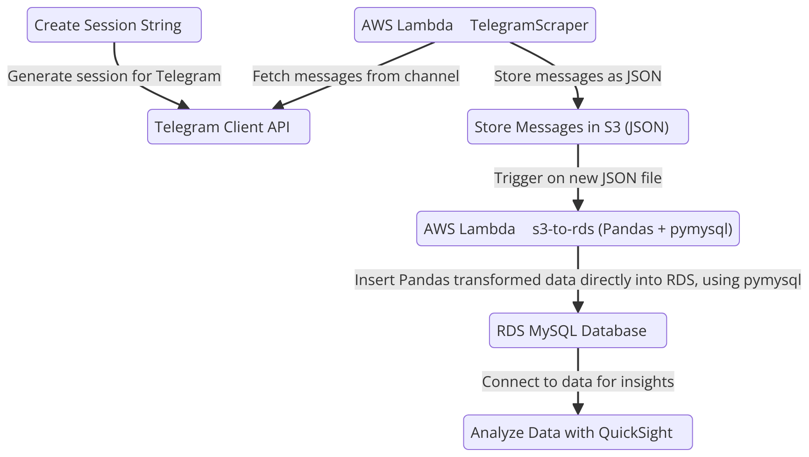

# Telegram Data Scraper with AWS Lambda

## Project Overview
This project demonstrates how to build a serverless application using AWS Lambda, S3, and RDS to scrape, process, and store messages from a Telegram channel. It leverages **Telethon** for scraping Telegram and **Pandas** for data transformation. The processed data is stored in an **RDS MySQL** database.

## Project Architecture

Below is a visual representation of the project flow:




### Components:
1. **Local Python Execution**: The project was initially run locally to set up and test Telegram scraping functionality.
2. **1st Lambda Function - Telegram Scraper**: Scrapes messages from a Telegram channel and stores them as JSON in an S3 bucket.
3. **2nd Lambda Function - S3 to RDS**: Processes the data from S3 using Pandas and inserts it into an RDS MySQL database.

## Features
- **Telegram Scraping**: Retrieves messages from a specified Telegram channel using Telethon.
- **Serverless Architecture**: Both the scraping and data processing tasks are managed by AWS Lambda.
- **Data Storage**: Raw data is saved as JSON in an S3 bucket, and the processed data is stored in an RDS MySQL database.

## Layers Used in Lambda Functions

1. **AWSSDKPandas-Python312**: This layer includes the AWS SDK and Pandas for Python 3.12, used for data processing and interactions with AWS services (S3, RDS).
   - ARN: `arn:aws:lambda:us-east-1:336392948345:layer:AWSSDKPandas-Python312:13`

2. **PyMySQL Layer**: A custom Lambda layer that provides PyMySQL for interacting with the MySQL RDS instance.
   - Packaged in the repository under `pymysql-layer/`.

## RDS Configuration

- **DB Instance ID**: `telegram-proj-mysql`
- **Engine Version**: `MySQL 8.0.35`
- **Instance Class**: `db.t4g.micro`
- **vCPU**: 2
- **RAM**: 1 GB
- **Storage Type**: General Purpose SSD (gp3)
- **Storage Size**: 20 GiB
- **Provisioned IOPS**: 3000 IOPS
- **Master Username**: `admin`
- **Amazon Resource Name (ARN)**: `arn:aws:rds:us-east-1:971422709739:db:telegram-proj-mysql`
- **Encryption**: Enabled with AWS KMS

### Security Groups

- **Security Group**: `rds-lambda-1`
- **VPC Security Group**: `rds-lambda-1 (sg-020d5daa18e3096b4)`

## Architecture Overview

1. **Telegram Scraper Lambda (1st Lambda)**:
   - Retrieves data from Telegram using the Telethon library.
   - Stores scraped messages in JSON format in an S3 bucket.

2. **S3 Storage**:
   - Raw JSON files are stored in an S3 bucket for further processing.

3. **S3 to RDS Lambda (2nd Lambda)**:
   - Reads the JSON files from the S3 bucket.
   - Cleans and transforms the data using Pandas.
   - Inserts the processed data into an RDS MySQL database.

## Prerequisites
Before deploying this project, ensure you have the following:
- **AWS Account** with access to:
  - AWS Lambda
  - S3
  - RDS (MySQL)
- **Python 3.x** installed locally
- **AWS CLI** configured with necessary permissions
- **Telethon**, **Pandas**, and **PyMySQL** libraries
- **MySQL Database** running on AWS RDS

## Project Setup

### 1. Clone the Repository
```bash
git clone https://github.com/yourusername/telegram-data-scraper.git
cd telegram-data-scraper
```

### 2. Install Python Dependencies
Instead of using a virtual environment, install the necessary Python packages directly in your environment:
```bash
pip install -r requirements.txt
```

### 3. Configure AWS Services
1. **S3 Bucket**: Create a new S3 bucket where the JSON files will be stored.
2. **RDS MySQL Database**: Set up an RDS MySQL instance and note the connection details (host, username, password).

### 4. Environment Variables
Environment variables such as Telegram API keys, S3 bucket name, and RDS credentials are added manually in the Lambda function settings under the **Environment Variables** section of each Lambda function.

### 5. Deploy the Lambda Functions
Package and deploy both Lambda functions using the AWS CLI or the AWS Management Console.

```bash
# For the Telegram Scraper Lambda
zip -r lambda_function.zip .
aws lambda update-function-code --function-name telegram-scraper-lambda --zip-file fileb://lambda_function.zip

# For the S3 to RDS Lambda
zip -r s3_to_rds_lambda.zip .
aws lambda update-function-code --function-name s3-to-rds-lambda --zip-file fileb://s3_to_rds_lambda.zip
```

## Usage
Once deployed, the project will operate as follows:
1. **1st Lambda Function** scrapes data from Telegram and stores it in an S3 bucket.
2. **2nd Lambda Function** retrieves the JSON files from S3, processes them with Pandas, and inserts the data into an RDS MySQL database.

## Example Output
Example of the processed data:
| Message | Event  | Area  | Datetime          | City     |
|---------|--------|-------|-------------------|----------|
| Sample1 | Alert  | North | 24/09/2024 10:30AM | Haifa    |
| Sample2 | Warning| South | 24/09/2024 12:00PM | Tel Aviv |

## Dependencies
Install the necessary Python libraries with:
```bash
pip install -r requirements.txt
```

Dependencies include:
- **Telethon**: For interacting with Telegram API
- **Pandas**: For data processing
- **PyMySQL**: For MySQL database interaction
- **boto3**: For AWS S3 operations

## License
This project is licensed under the MIT License - see the [LICENSE](LICENSE) file for details.

## Contact
For any inquiries or issues, reach out to: `your-email@example.com`.
